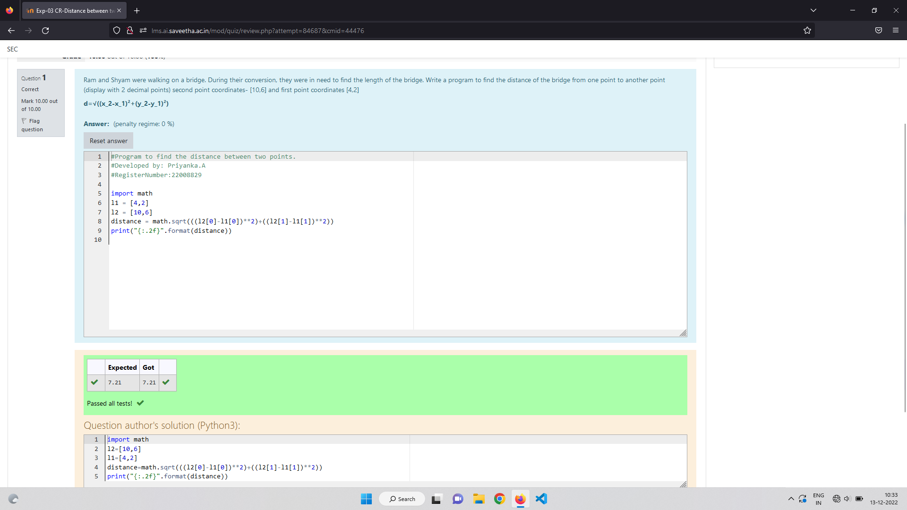

# DISTANCE-BETWEEN-TWO-POINTS

## AIM:
To write a python program to find the distance two 2 points
## ALGORITHM:
### Step 1: 
import math
### Step 2: 
list the elements in array
### Step 3: 
Substitute the values in the distance 
### Step 4: 
print the distance using formula
### Step 5: 
End the program.

### PROGRAM:
```python
#Program to find distance between two points
#Developed by: Priyanka.A
#RegisterNumber: 22008829
import math
l1 = [4,2]
l2 = [10,6]
distance = math.sqrt(((12[0]-l1[0])**2)+((l2[1]-l1[1])**2))
print("{:.2f}".format(distance))
```


### OUTPUT:



### RESULT:
Thus the distance between two points are successfully executed.
